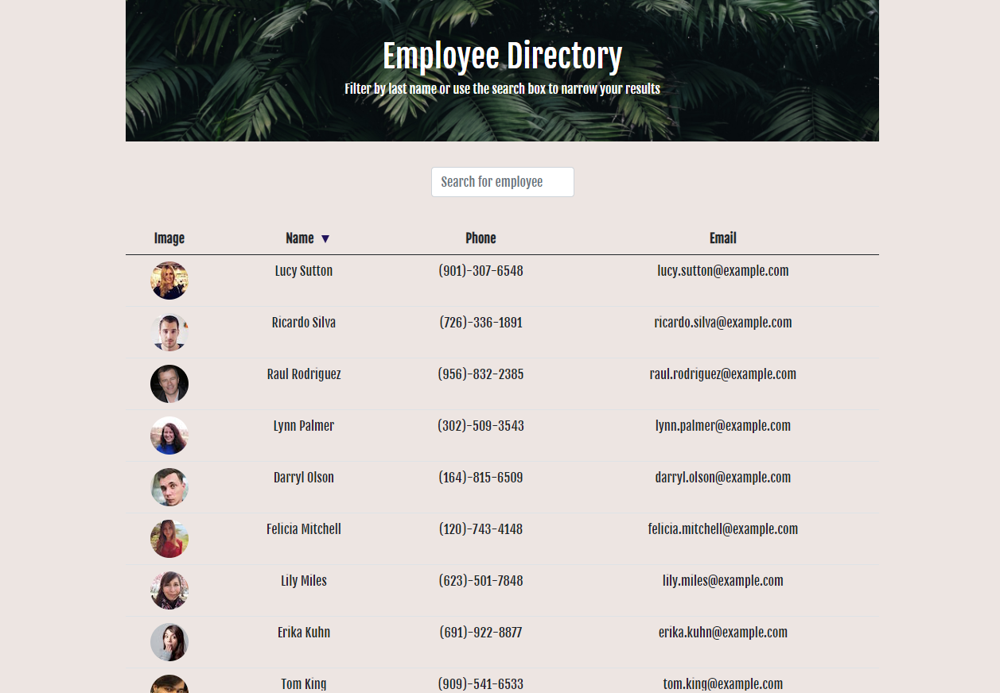

# Employee Directory

## Introduction

This a React app that lets you view a list of employees, search for a specific employee, and sort the employee by name. When you search for an employee it will immediately give you a result and clicking on the arrow next to the "Name" column will sort the employees either in ascending or descending order.

## Live Demo

[Deployed App](https://awiehrs.github.io/Employee-Directory/)

## Installation

Project bootstrapped with create-react-app. Make sure to install dependencies with 
```
npm i
```
before deploying.

## Usage
Search for Employees in the search bar. All queries are case-sensitive.

## Preview

  